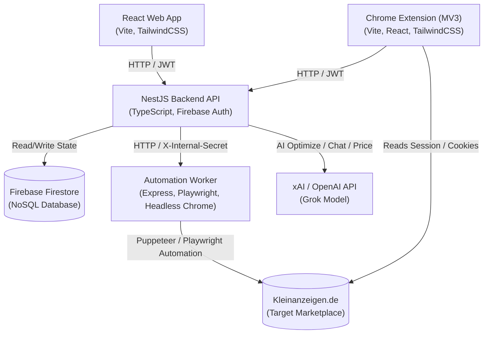
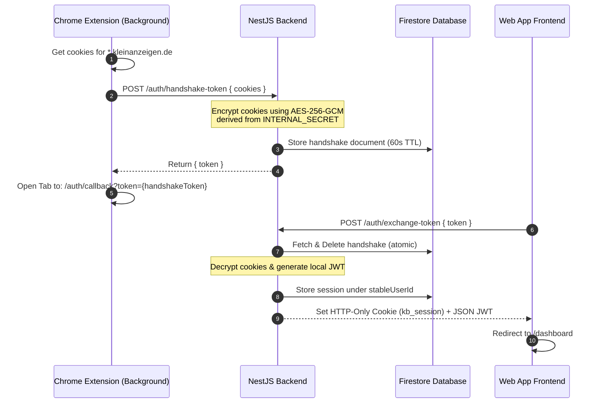
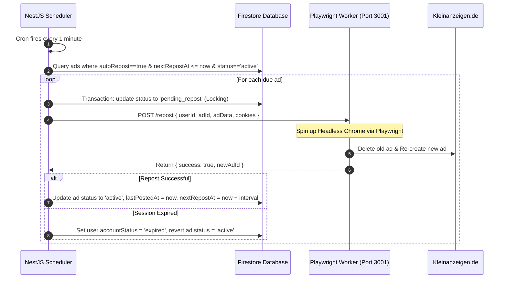
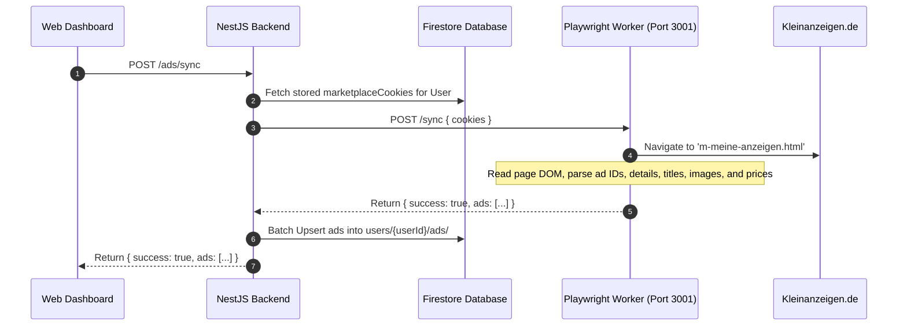

# AnzeigenBoost — System Architecture

**AnzeigenBoost** (`anzeigenboost.de`) is a German-market SaaS monorepo designed to automate the syncing, monitoring, optimization, and reposting of ads on the **Kleinanzeigen.de** marketplace.

This document details the multi-service system architecture, data flow schemas, security measures, and execution sequences that govern AnzeigenBoost.

---

## 1. System Topology

The AnzeigenBoost ecosystem comprises four primary components interacting with a central database (Firebase Firestore) and external APIs (Kleinanzeigen.de and AI services).



---

## 2. Component Directory Breakdown

AnzeigenBoost is structured as a monorepo consisting of:

| Component | Technology Stack | Core Role | Key Directory Location |
| :--- | :--- | :--- | :--- |
| **Backend** | NestJS 10, TypeScript, Axios, JWT | Session storage, Orchestration, cron execution, AI integrations, Firestore mapping | [`backend/src/`](file:///Users/ahmed/Documents/me/kleinzeigen_project/backend/src) |
| **Frontend** | React 18, Vite, TailwindCSS | Web dashboard, subscription control, AI chat dashboard, settings management | [`frontend/src/`](file:///Users/ahmed/Documents/me/kleinzeigen_project/frontend/src) |
| **Automation** | Express, Playwright, Headless Chrome | Executing browser automation tasks (Login, 2FA, scraping ads, reposting) | [`automation/src/`](file:///Users/ahmed/Documents/me/kleinzeigen_project/automation/src) |
| **Extension** | Manifest V3, React 18, Vite, TailwindCSS | Chrome-injected badges, details-page repost buttons, quick dashboard & local cookie handshake | [`extension/src/`](file:///Users/ahmed/Documents/me/kleinzeigen_project/extension/src) |

---

## 3. Database Schema (Firestore)

AnzeigenBoost uses Firebase Firestore as its persistence layer. The data models are organized as follows:

```
├── users (Collection)
│   └── {userId} (Document)
│       ├── email: string
│       ├── accountStatus: 'active' | 'expired'
│       └── ads (Sub-collection)
│           └── {adId} (Document)
│               ├── id: string (Kleinanzeigen ID)
│               ├── title: string
│               ├── description: string
│               ├── price: number
│               ├── status: 'active' | 'pending_repost' | 'reserviert' | 'Pausiert'
│               ├── autoRepost: boolean
│               ├── repostIntervalMinutes: number (e.g. 1440)
│               ├── lastPostedAt: ISO-String
│               └── nextRepostAt: ISO-String
│
├── sessions (Collection)
│   └── {userId} (Document)
│       ├── token: string (JWT)
│       ├── status: 'active' | 'expired'
│       ├── lastLogin: ISO-String
│       └── marketplaceCookies: Array<CookieObject>
│
└── handshakes (Collection)
    └── {handshakeToken} (Document)
        ├── encryptedCookies: string (AES-256-GCM hex string)
        ├── stableUserId: string
        ├── createdAt: ISO-String
        └── expiresAt: Timestamp
```

---

## 4. Key Workflows & Sequences

### 4.1 Cookie Handshake Authentication Sequence
To bypass traditional logins that trigger frequent CAPTCHAs, the **Chrome Extension** captures active Kleinanzeigen.de session cookies directly from the browser context and forwards them securely to the NestJS backend to create a local user session.



---

### 4.2 Automated Repost Flow
Automated reposting replicates deleting an expired ad and recreation of the ad at the top of the search index. The `SchedulerService` manages cron executions.



---

### 4.3 Scraping / Sync Flow
Imports listings from Kleinanzeigen.de to keep the AnzeigenBoost dashboard synchronized.



---

## 5. Security & Cryptography

### 5.1 AES-256-GCM Session Encryption
Marketplace session cookies contain critical secrets. To protect them at rest inside Firestore:
1. **Derivation**: A 32-byte encryption key is derived using SHA-256 hashing on the server's `INTERNAL_SECRET`.
2. **Encryption**: `AuthService.encryptData` generates a unique Initial Vector (`IV`, 16 bytes), performs encryption using `aes-256-gcm`, extracts the Auth Tag, and stores the format: `iv:authTag:encryptedHex`.
3. **Decryption**: Decrypted on-the-fly when dispatching tasks to the automation workers.

### 5.2 Microservice Security
The `automation` service is deployed internally. All HTTP communication from the NestJS Backend is secured using:
- **Authorization Header**: Exposing `X-Internal-Secret` matching the backend environment variable.
- **Access Control**: Requests with invalid secrets are immediately rejected with a `403 Forbidden` response.

---

## 6. Future Multi-Platform Expansion Path

The architecture is designed to support modular expansions to other European marketplaces.

```
                   ┌──────────────┐
                   │ NestJS Core  │
                   └──────┬───────┘
                          │ Call worker
                          ▼
            ┌───────────────────────────┐
            │   Automation Middleware   │
            └─────────────┬─────────────┘
                          │
          ┌───────────────┼───────────────┐
          ▼               ▼               ▼
   ┌─────────────┐ ┌─────────────┐ ┌─────────────┐
   │  Germany    │ │   Austria   │ │ Switzerland │
   │Kleinanzeigen│ │ Willhaben.at│ │ Ricardo.ch  │
   └─────────────┘ └─────────────┘ └─────────────┘
```

By abstracting site interactions inside the automation worker's routes `/login`, `/sync`, and `/repost`, adding secondary platforms (such as Willhaben.at or Ricardo.ch) requires adding targeted page-object wrappers to Playwright without altering the database schema or the frontend views.
