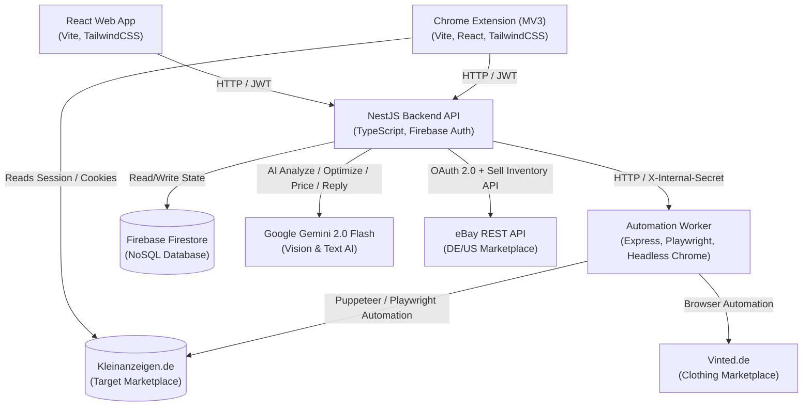
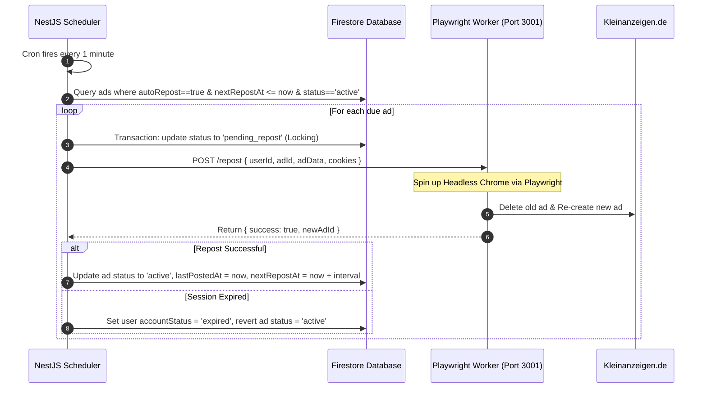
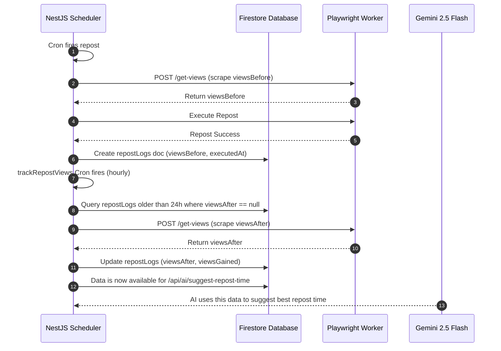
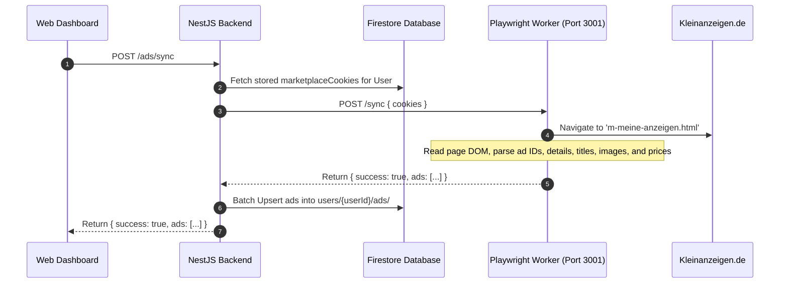
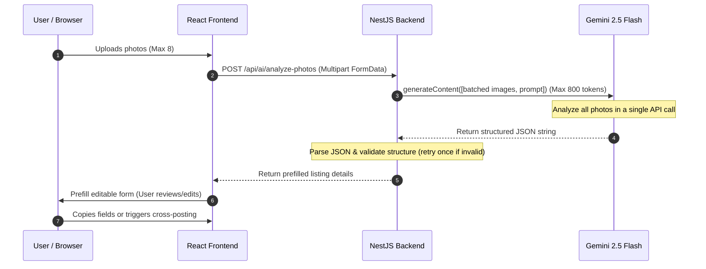
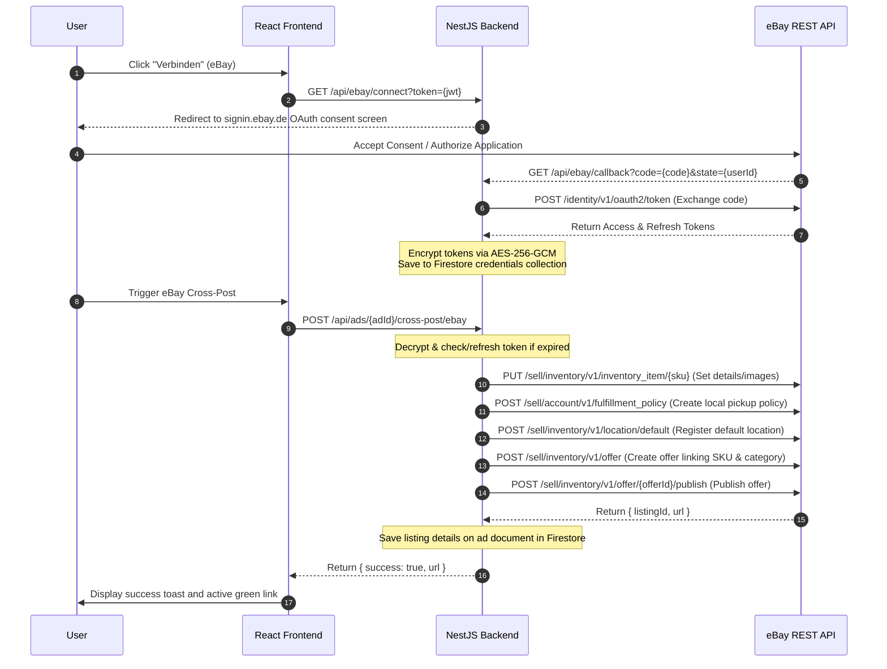

# AnzeigenBoost — System Architecture

**AnzeigenBoost** (`anzeigenboost.de`) is a German-market SaaS monorepo designed to automate the syncing, monitoring, optimization, and reposting of ads on the **Kleinanzeigen.de** marketplace.

This document details the multi-service system architecture, data flow schemas, security measures, and execution sequences that govern AnzeigenBoost.

---

## 1. System Topology

The AnzeigenBoost ecosystem comprises four primary components interacting with a central database (Firebase Firestore) and external APIs (Kleinanzeigen.de, Vinted, eBay, and AI services).



---

## 2. Component Directory Breakdown

AnzeigenBoost is structured as a monorepo consisting of:

| Component | Technology Stack | Core Role | Key Directory Location |
| :--- | :--- | :--- | :--- |
| **Backend** | NestJS 10, TypeScript, Axios, JWT | Session storage, Orchestration, cron execution, AI integrations, Firestore mapping | [`backend/src/`](file:///Users/ahmed/Documents/me/kleinzeigen_project/backend/src) |
| **eBay Module** | eBay REST Sell API with OAuth 2.0 | Cross-platform listing management | [`backend/src/ebay/`](file:///Users/ahmed/Documents/me/kleinzeigen_project/backend/src/ebay/) |
| **Frontend** | React 18, Vite, TailwindCSS | Web dashboard, subscription control, AI chat dashboard, settings management | [`frontend/src/`](file:///Users/ahmed/Documents/me/kleinzeigen_project/frontend/src) |
| **Automation** | Express, Playwright, Headless Chrome | Executing browser automation tasks (Login, 2FA, scraping ads, reposting) | [`automation/src/`](file:///Users/ahmed/Documents/me/kleinzeigen_project/automation/src) |
| **Extension** | Manifest V3, React 18, Vite, TailwindCSS | Chrome-injected badges, details-page repost buttons, quick dashboard & local cookie handshake | [`extension/src/`](file:///Users/ahmed/Documents/me/kleinzeigen_project/extension/src) |

---

## 3. Database Schema (Firestore)

AnzeigenBoost uses Firebase Firestore as its persistence layer. The data models are organized as follows:

```
├── users (Collection)
│   └── {userId} (Document)
│       ├── email: string
│       ├── accountStatus: 'active' | 'expired'
│       ├── ebayAccessToken: string (encrypted)
│       ├── ebayRefreshToken: string (encrypted)
│       ├── ebayTokenExpiresAt: string (ISO string)
│       └── ads (Sub-collection)
│           └── {adId} (Document)
│               ├── id: string (Kleinanzeigen ID)
│               ├── title: string
│               ├── description: string
│               ├── price: number
│               ├── status: 'active' | 'pending_repost' | 'reserviert' | 'Pausiert' | 'pending'
│               ├── autoRepost: boolean
│               ├── repostIntervalMinutes: number (e.g. 1440)
│               ├── lastPostedAt: ISO-String
│               ├── nextRepostAt: ISO-String
│               ├── vintedId: string
│               ├── vintedUrl: string
│               ├── vintedLastPostedAt: string (ISO string)
│               ├── vintedStatus: string
│               ├── ebayListingId: string
│               ├── ebayUrl: string
│               ├── ebayLastPostedAt: string (ISO string)
│               ├── aiSuggestedRepostDay: number (0-6)
│               ├── aiSuggestedRepostHour: number (0-23)
│               ├── aiSuggestionConfidence: number
│               └── aiSuggestionReasoning: string
│               └── repostLogs (Sub-collection)
│                   └── {logId} (Document)
│                       ├── status: 'success' | 'failed'
│                       ├── executedAt: ISO-String
│                       ├── durationMs: number
│                       ├── viewsBefore: number
│                       ├── viewsAfter: number
│                       └── viewsGained: number
│
├── schedulerMeta (Collection)
│   └── schedulerMeta (Document)
│       └── lastRunAt: ISO-String
│
├── sessions (Collection)
│   └── {userId} (Document)
│       ├── token: string (JWT)
│       ├── status: 'active' | 'expired'
│       ├── lastLogin: ISO-String
│       └── marketplaceCookies: Array<CookieObject>
│
└── handshakes (Collection)
    └── {handshakeToken} (Document)
        ├── encryptedCookies: string (AES-256-GCM hex string)
        ├── stableUserId: string
        ├── createdAt: ISO-String
        └── expiresAt: Timestamp
```

---

## 4. Key Workflows & Sequences

### 4.1 Cookie Handshake Authentication Sequence
To bypass traditional logins that trigger frequent CAPTCHAs, the **Chrome Extension** captures active Kleinanzeigen.de session cookies directly from the browser context and forwards them securely to the NestJS backend to create a local user session.


---

### 4.2 Automated Repost Flow
Automated reposting replicates deleting an expired ad and recreation of the ad at the top of the search index. The `SchedulerService` manages cron executions.



---

### 4.3 Repost View Tracking Flow
Tracks ad views before and 24 hours after an automated repost to feed into the AI suggestion engine.



---

### 4.4 Scraping / Sync Flow
Imports listings from Kleinanzeigen.de to keep the AnzeigenBoost dashboard synchronized.



---

### 4.5 Photo-to-Prefill AI Flow
Extracts structured product data from uploaded photos to prefill new ad creation forms.



---

### 4.6 eBay OAuth + Listing Flow
Connects user accounts and publishes listings to the official eBay marketplace.



---

## 5. Security & Cryptography

### 5.1 AES-256-GCM Session Encryption
Marketplace session cookies contain critical secrets. To protect them at rest inside Firestore:
1. **Derivation**: A 32-byte encryption key is derived using SHA-256 hashing on the server's `INTERNAL_SECRET`.
2. **Encryption**: `AuthService.encryptData` generates a unique Initial Vector (`IV`, 16 bytes), performs encryption using `aes-256-gcm`, extracts the Auth Tag, and stores the format: `iv:authTag:encryptedHex`.
3. **Decryption**: Decrypted on-the-fly when dispatching tasks to the automation workers.

### 5.2 Microservice Security
The `automation` service is deployed internally. All HTTP communication from the NestJS Backend is secured using:
- **Authorization Header**: Exposing `X-Internal-Secret` matching the backend environment variable.
- **Access Control**: Requests with invalid secrets are immediately rejected with a `403 Forbidden` response.

### 5.3 Cookie Handshake Security
The extension-to-backend cookie handshake uses an extended **120s TTL** on handshake documents to account for slower network connections. When the backend exchanges the token, it employs an **atomic read-and-delete pattern** in Firestore to ensure the handshake token can only be consumed exactly once, preventing replay attacks.

---

## 6. LLM Cost Management

To optimize operational expenses while maintaining low-latency processing:

- **Gemini 2.0 Flash Free Tier:** Utilizes Google's generative free tier providing up to 1,500 requests per day at zero platform cost.
- **Enforced Usage Limits:** Tracks API consumption inside the `aiUsage` Firestore collection. Restricts free plans to 5 requests/month and starter plans to 30 requests/month, preventing denial-of-service bill inflation.
- **Explicit Output Controls:** Every Gemini invocation enforces strict limits via `maxOutputTokens` configured per endpoint:
  - Photo Analysis (`analyze-photos`): Max 800 tokens
  - Ad Text Optimization (`optimize-ad`): Max 600 tokens
  - Price Check (`price-check`): Max 400 tokens
  - Reply Suggestions (`reply-suggestions`): Max 300 tokens
- **Batched Image Analysis:** Transmits all selected product photos in a single API call (supporting up to 16 images in Gemini 2.0 Flash), avoiding multiple consecutive image calls.
- **Gemini Paid Tier Upgrade Path:** Provides a seamless pay-as-you-go transition path to paid Gemini API endpoints when daily free limits are exhausted. Paid tier costs are set at $0.075 per million input tokens and $0.30 per million output tokens, keeping individual listing costs fractionally small.

---

## 7. Platform Integrations

AnzeigenBoost features distinct integration methodologies for the three supported marketplaces:

1. **Kleinanzeigen.de**: Integrates via **Cookie Handshake (Chrome Extension)**. The extension captures an existing, active session cookie directly from the user's browser context. This prevents Cloudflare/Datadome CAPTCHAs, as the headless browser assumes an already trusted session without needing to log in programmatically.
2. **Vinted.de**: Integrates via **Playwright Session Automation**. Users provide their Vinted credentials via an inline AES-256 secure modal. The Playwright worker spins up a headless browser, physically navigates to Vinted, fills the login form, handles CSRF tokens natively, and retains the session state for cross-posting clothing inventory.
3. **eBay**: Integrates via the official **OAuth 2.0 Authorization Code Grant**. Users connect their accounts via the standard eBay consent screen. The backend exchanges the grant code for access and refresh tokens, handling automatic token refreshes in the background before invoking the eBay REST Sell API (Inventory, Offers, Policies) for publishing.

---

## 8. Future Multi-Platform Expansion Path

The architecture is designed to support modular expansions to other European marketplaces.

```
                   ┌──────────────┐
                   │ NestJS Core  │
                   └──────┬───────┘
                          │ Call worker
                          ▼
            ┌───────────────────────────┐
            │   Automation Middleware   │
            └─────────────┬─────────────┘
                          │
          ┌───────────────┼───────────────┐
          ▼               ▼               ▼
    ┌─────────────┐ ┌─────────────┐ ┌─────────────┐
    │  Germany    │ │   Austria   │ │ Switzerland │
    │Kleinanzeigen│ │ Willhaben.at│ │ Ricardo.ch  │
    └─────────────┘ └─────────────┘ └─────────────┘
```

By abstracting site interactions inside the automation worker's routes `/login`, `/sync`, and `/repost`, adding secondary platforms (such as Willhaben.at or Ricardo.ch) requires adding targeted page-object wrappers to Playwright without altering the database schema or the frontend views.
